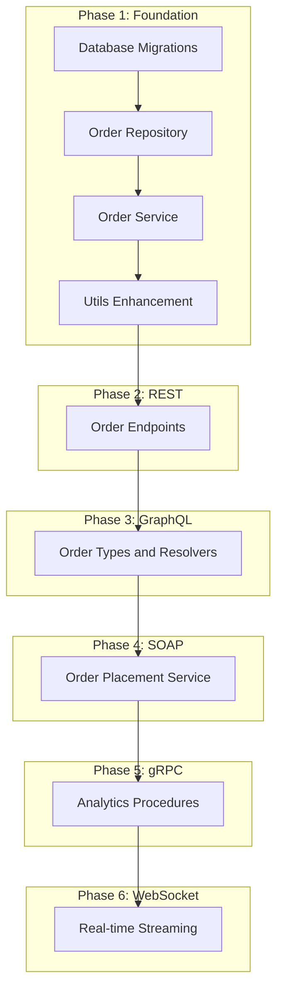

# Go Multi-API Inventory System - Development Plan

## Current State Analysis

### What Exists and Works

| Layer | Component | Status |

|-------|-----------|--------|

| **Models** | `Product` struct | Complete |

| **Models** | `Orders` struct | Defined but needs revision |

| **Repos** | `ProductRepo` interface + implementation | Complete |

| **Repos** | `OrderRepo` | Empty stub |

| **Services** | `ProductService` interface + implementation | Complete |

| **Services** | `OrderService` | Empty stub |

| **REST** | `ProductHandler` (CRUD) | Complete |

| **REST** | `OrderHandler` | Empty stub |

| **GraphQL** | Schema, Types, Queries (`product`, `products`) | Working |

| **GraphQL** | Mutations (`updateProduct`) | Working |

| **GraphQL** | Order types/queries/mutations | Missing |

| **gRPC** | | Empty stub |

| **SOAP** | | Empty stub |

| **WebSocket** | | Directory doesn't exist |

| **Utils** | Logger, DB pool, Error types | Basic implementation |

### Technical Debt Identified

1. `ProductRepo.UpdateByID` takes `*context.Context` instead of `context.Context`
2. `Orders.Amount` is `string` but should be `float64` for calculations
3. GraphQL missing `createProduct` and `deleteProduct` mutations
4. No input validation layer
5. No database migration files

---

## Development Strategy

**Approach**: Build foundation completely before any API work. Each API is completed fully before moving to the next.

---

## Phase 1: Foundation Layer

### 1.1 Database Migrations

- [ ] Create migration file structure in `/migrations` directory
  - [ ] Define naming convention (e.g., `001_create_products.sql`, `002_create_orders.sql`)
  - [ ] Add `products` table DDL with proper CockroachDB types
  - [ ] Add `orders` table DDL with foreign key to products
  - **Verify**: Tables can be created/dropped idempotently; foreign key constraints work
  - **Go Fundamentals**: N/A (SQL files), but understand how `sqlx` maps columns via struct tags

### 1.2 Fix Existing Model Issues

- [ ] Fix [`models/models.go`](models/models.go) inconsistencies
  - [ ] Change `Orders.Amount` from `string` to `float64`
  - [ ] Align `Orders.CreatedAt` field naming with database column (`order_time`)
  - [ ] Add JSON tags to `Orders` struct for API responses
  - [ ] Create `CreateOrderReq` struct with validation tags
  - **Verify**: Struct tags match database columns exactly; JSON serialization works
  - **Go Fundamentals**: Struct tags, field visibility (exported vs unexported)

### 1.3 Order Repository Layer

- [ ] Define `OrderRepo` interface in [`repos/order_repo.go`](repos/order_repo.go)
  - [ ] `Create(ctx context.Context, order *models.Order) (models.Order, error)`
  - [ ] `FetchByID(ctx context.Context, id int64) (models.Order, error)`
  - [ ] `FetchAll(ctx context.Context) ([]models.Order, error)`
  - [ ] `FetchByProductID(ctx context.Context, productID int64) ([]models.Order, error)`
- [ ] Implement `pgOrderRepo` struct with `*sqlx.DB` dependency
- [ ] Implement all interface methods with proper error wrapping
  - **Verify**: All methods accept `context.Context` as first param; errors wrapped with `fmt.Errorf` and `%w`
  - **Go Fundamentals**: Interfaces define contracts; accept interfaces, return structs; always propagate context

### 1.4 Order Service Layer

- [ ] Define `OrderService` interface in [`services/order_service.go`](services/order_service.go)
  - [ ] `PlaceOrder(ctx context.Context, req *models.CreateOrderReq) (models.Order, error)`
  - [ ] `GetOrder(ctx context.Context, id int64) (models.Order, error)`
  - [ ] `GetAllOrders(ctx context.Context) ([]models.Order, error)`
  - [ ] `GetOrdersByProduct(ctx context.Context, productID int64) ([]models.Order, error)`
- [ ] Implement `orderService` struct with `OrderRepo` and `ProductRepo` dependencies
- [ ] Implement business logic in `PlaceOrder`:
  - [ ] Validate product exists
  - [ ] Check stock availability
  - [ ] Calculate `total_price` (quantity * product.price)
  - [ ] Decrement product stock (requires `ProductRepo` call)
  - **Verify**: No direct database calls; all data access through repos; proper error handling
  - **Go Fundamentals**: Dependency injection via constructor; service layer orchestrates repos

### 1.5 Fix ProductRepo Context Issue

- [ ] Change `UpdateByID` signature in [`repos/product_repo.go`](repos/product_repo.go)
  - [ ] Change `UpdateByID(ctx *context.Context, ...)` to `UpdateByID(ctx context.Context, ...)`
  - [ ] Update implementation to use `ctx` directly (not `*ctx`)
  - [ ] Update service layer call in [`services/product_service.go`](services/product_service.go)
  - **Verify**: All repo methods have consistent signatures; no pointer-to-context anywhere
  - **Go Fundamentals**: Context is passed by value, never as pointer

### 1.6 Utils Enhancement

- [ ] Add validation utilities to [`utils/validations.go`](utils/validations.go)
  - [ ] Create `ValidateStruct` function using struct tags or manual validation
  - [ ] Return structured validation errors
- [ ] Enhance [`utils/errors.go`](utils/errors.go)
  - [ ] Add `ErrInsufficientStock` error type
  - [ ] Add `ErrInvalidInput` error type
  - [ ] Consider error type assertions pattern for handlers
- [ ] Add DB pool configuration to [`utils/utils.go`](utils/utils.go)
  - [ ] Set `MaxOpenConns`, `MaxIdleConns`, `ConnMaxLifetime`
  - **Verify**: Pool settings are reasonable for learning project; errors are sentinel or typed
  - **Go Fundamentals**: Sentinel errors with `errors.Is()`; typed errors with `errors.As()`

---

### CODE REVIEW CHECKPOINT: Foundation Complete

**Architecture Review:**

- [ ] Repos only do data access, no business logic
- [ ] Services contain all business logic, no SQL
- [ ] Both Order and Product repos implement interfaces
- [ ] Dependency injection used consistently (constructor functions)

**Go Conventions:**

- [ ] All exported types/functions have PascalCase names
- [ ] All unexported fields use camelCase
- [ ] Error wrapping uses `fmt.Errorf("layer.method: %w", err)` pattern
- [ ] No naked returns in multi-return functions

**Performance & Concurrency:**

- [ ] All repo/service methods accept `context.Context` as first param
- [ ] DB connection pool is configured
- [ ] No goroutines in foundation layer (not needed yet)

**Security & Validation:**

- [ ] Parameterized queries only (no string concatenation for SQL)
- [ ] Input validation structs defined

---

## Phase 2: REST API (Completion)

Current state: Product CRUD complete, Order endpoints missing.

### 2.1 Order REST Endpoints

- [ ] Create `OrderHandler` in [`api/rest/order_handler.go`](api/rest/order_handler.go)
  - [ ] Constructor: `NewOrderHandler(svc services.OrderService, log *zap.Logger)`
  - [ ] `CreateOrder` handler (POST `/order`)
  - [ ] `GetOrder` handler (GET `/order/{id}`)
  - [ ] `GetAllOrders` handler (GET `/orders`)
- [ ] Register routes in [`main.go`](main.go)
  - [ ] Initialize order repo, service, handler
  - [ ] Add route registrations to mux
  - **Verify**: Handlers only parse input and call services; proper HTTP status codes used
  - **Go Fundamentals**: Handler signature `func(w http.ResponseWriter, r *http.Request)`; use `r.Context()` for context propagation

### 2.2 REST API Polish

- [ ] Review and fix HTTP status codes in existing handlers
  - [ ] `FetchProduct` returns 200, not 201
  - [ ] `UpdateProduct` returns 200, not 201  
  - [ ] `DeleteProduct` returns 200 or 204
- [ ] Add consistent response envelope (optional, but good practice)
  - **Verify**: GET returns 200, POST returns 201, errors return appropriate 4xx/5xx
  - **Go Fundamentals**: HTTP semantics; `http.StatusOK`, `http.StatusCreated`, etc.

---

### CODE REVIEW CHECKPOINT: REST Complete

- [ ] All CRUD operations work for both Product and Order
- [ ] Consistent JSON response format
- [ ] Proper error responses (never expose stack traces)
- [ ] HTTP methods and status codes follow REST conventions

---

## Phase 3: GraphQL API (Completion)

Current state: Product queries and updateProduct mutation work. Missing order types, createProduct, deleteProduct.

### 3.1 Complete Product Mutations

- [ ] Add `createProduct` mutation in [`api/graphql/mutations.go`](api/graphql/mutations.go)
  - [ ] Define input type in [`types.go`](api/graphql/types.go)
  - [ ] Add resolver method in [`resolvers.go`](api/graphql/resolvers.go)
- [ ] Add `deleteProduct` mutation
  - [ ] Takes ID argument, returns deleted product or boolean
  - **Verify**: Mutations call service layer; proper error handling in resolvers
  - **Go Fundamentals**: Type assertions for GraphQL args `p.Args["key"].(type)`

### 3.2 Order GraphQL Types

- [ ] Define `OrderType` in [`api/graphql/types.go`](api/graphql/types.go)
  - [ ] Fields: `order_id`, `product_id`, `quantity`, `total_price`, `order_time`
  - [ ] Consider adding `product` field with resolver for nested queries
- [ ] Define `CreateOrderInput` input type
  - **Verify**: Types match models; nullable fields handled correctly
  - **Go Fundamentals**: GraphQL-Go library patterns; `graphql.NewObject`, `graphql.NewInputObject`

### 3.3 Order Queries and Mutations

- [ ] Add order queries in [`queries.go`](api/graphql/queries.go)
  - [ ] `order(id: String!)` - single order
  - [ ] `orders` - all orders
  - [ ] `ordersByProduct(productId: String!)` - orders for a product
- [ ] Add order mutation: `placeOrder(input: CreateOrderInput!)` in mutations.go
- [ ] Implement resolvers for all new queries/mutations
- [ ] Update schema initialization to inject `OrderService`
  - **Verify**: All resolvers use context from `ResolveParams`; services are injected, not global
  - **Go Fundamentals**: Closure pattern for resolver functions with service access

---

### CODE REVIEW CHECKPOINT: GraphQL Complete

- [ ] All product and order operations available via GraphQL
- [ ] Schema introspection works (`__schema` query)
- [ ] Proper error messages returned (not internal details)
- [ ] Context propagated from HTTP request through resolvers to services

---

## Phase 4: SOAP API

Purpose: Secure transactional order placement with strict XML contracts.

### 4.1 SOAP Infrastructure

- [ ] Choose approach: manual XML or minimal library
  - [ ] Option A: `encoding/xml` (recommended for learning)
  - [ ] Option B: Use `github.com/hooklift/gowsdl` (more complex)
- [ ] Create SOAP types in [`api/soap/soap.go`](api/soap/soap.go) or new files
  - [ ] Define `SOAPEnvelope`, `SOAPBody`, `SOAPFault` structs with XML tags
  - **Verify**: XML marshaling/unmarshaling works correctly
  - **Go Fundamentals**: `encoding/xml` package; struct tags for XML (`xml:"name"`)

### 4.2 SOAP Order Service

- [ ] Define SOAP request/response types
  - [ ] `PlaceOrderRequest` with product_id, quantity
  - [ ] `PlaceOrderResponse` with order details
  - [ ] `SOAPFault` for error responses
- [ ] Create SOAP handler function
  - [ ] Parse SOAP envelope from request body
  - [ ] Extract action from SOAPAction header or body
  - [ ] Call `OrderService.PlaceOrder`
  - [ ] Wrap response in SOAP envelope
- [ ] Register `/soap` endpoint in main.go
  - **Verify**: SOAP envelope structure is valid; SOAPAction header supported
  - **Go Fundamentals**: `xml.Unmarshal`, `xml.Marshal`; HTTP header handling

### 4.3 WSDL Generation (Optional)

- [ ] Create static WSDL file describing the service
- [ ] Serve WSDL at `/soap?wsdl`
  - **Verify**: WSDL is valid and describes available operations
  - **Go Fundamentals**: Serving static files; query parameter parsing

---

### CODE REVIEW CHECKPOINT: SOAP Complete

- [ ] Order placement works via SOAP
- [ ] Proper SOAPFault returned on errors
- [ ] XML namespace handling correct
- [ ] Content-Type is `text/xml` or `application/soap+xml`

---

## Phase 5: gRPC API

Purpose: High-performance analytics procedures.

### 5.1 Protocol Buffer Setup

- [ ] Install protoc compiler and Go plugins
  - [ ] `protoc-gen-go` and `protoc-gen-go-grpc`
- [ ] Create `/proto` directory
- [ ] Define `analytics.proto` service
  - [ ] Message types: `ProductStatsRequest`, `ProductStatsResponse`
  - [ ] Message types: `OrderSummaryRequest`, `OrderSummaryResponse`
  - [ ] Service definition with RPC methods
- [ ] Generate Go code from proto file
  - **Verify**: Generated code compiles; imports resolve correctly
  - **Go Fundamentals**: Protocol Buffers syntax; code generation workflow

### 5.2 Analytics Service Methods

- [ ] Add analytics methods to `OrderService` or create new `AnalyticsService`
  - [ ] `GetTotalOrderCount(ctx context.Context) (int64, error)`
  - [ ] `GetAverageOrderValue(ctx context.Context) (float64, error)`
  - [ ] `GetProductStats(ctx context.Context, productID int64) (stats, error)`
- [ ] Add necessary repo methods (may require aggregate queries)
  - **Verify**: Methods return computed values, not raw data for client computation
  - **Go Fundamentals**: Context usage in streaming; aggregate SQL queries

### 5.3 gRPC Server Implementation

- [ ] Implement gRPC service in [`api/grpc/grpc.go`](api/grpc/grpc.go)
  - [ ] Create struct implementing generated interface
  - [ ] Implement each RPC method
  - [ ] Inject service layer dependencies
- [ ] Start gRPC server (separate port from HTTP)
  - [ ] Recommended: port 50051
  - [ ] Add graceful shutdown
  - **Verify**: gRPC server starts without conflict; methods callable via grpcurl
  - **Go Fundamentals**: gRPC server lifecycle; separate goroutine for server

### 5.4 gRPC Streaming (Optional Enhancement)

- [ ] Add server-side streaming RPC for real-time stats
  - [ ] `StreamProductStats` that sends updates periodically
  - **Verify**: Stream properly closes; client can disconnect cleanly
  - **Go Fundamentals**: `stream.Send()` pattern; handling `context.Done()`

---

### CODE REVIEW CHECKPOINT: gRPC Complete

- [ ] All analytics RPCs return correct data
- [ ] gRPC reflection enabled for debugging
- [ ] Proper error codes used (codes.NotFound, codes.Internal, etc.)
- [ ] Server shuts down gracefully

---

## Phase 6: WebSocket API

Purpose: Real-time streaming of new orders and analytics updates.

### 6.1 WebSocket Infrastructure

- [ ] Create `/api/websocket` directory
- [ ] Choose WebSocket library
  - [ ] Option A: `gorilla/websocket` (most common)
  - [ ] Option B: `nhooyr.io/websocket` (newer, context-aware)
- [ ] Create WebSocket upgrader and handler
  - [ ] Define message types (JSON): `subscribe`, `unsubscribe`, `order_created`, `stats_update`
  - **Verify**: Upgrade handshake works; connection stays open
  - **Go Fundamentals**: HTTP upgrade mechanism; long-lived connections

### 6.2 Hub Pattern for Broadcasting

- [ ] Implement connection hub (pub/sub pattern)
  - [ ] Hub struct with `clients map`, `broadcast chan`, `register/unregister chan`
  - [ ] `Run()` method as goroutine managing all channels
  - [ ] Thread-safe client registration/deregistration
- [ ] Implement per-connection read/write pumps
  - [ ] `readPump()` - reads client messages, handles ping/pong
  - [ ] `writePump()` - writes messages from hub to client
  - **Verify**: Multiple clients can connect; messages broadcast to all
  - **Go Fundamentals**: Goroutines for each connection; channels for communication; `select` statement

### 6.3 Event Integration

- [ ] Modify `OrderService.PlaceOrder` to emit events
  - [ ] Option A: Pass event channel to service
  - [ ] Option B: Use callback pattern
  - [ ] Option C: Simple function call to hub
- [ ] Create periodic analytics updates
  - [ ] Goroutine with ticker sending stats every N seconds
  - **Verify**: New orders appear in WebSocket; analytics update periodically
  - **Go Fundamentals**: `time.Ticker`; goroutine lifecycle management; avoiding goroutine leaks

### 6.4 WebSocket Endpoint

- [ ] Register `/ws` endpoint in main.go
- [ ] Handle subscription messages (topics: "orders", "analytics")
- [ ] Implement proper connection cleanup on disconnect
  - **Verify**: Memory doesn't leak on client disconnect; clean shutdown
  - **Go Fundamentals**: `defer` for cleanup; context cancellation

---

### CODE REVIEW CHECKPOINT: WebSocket Complete

- [ ] Real-time order notifications work
- [ ] Analytics updates stream correctly
- [ ] Connections clean up properly
- [ ] No goroutine leaks (check with `runtime.NumGoroutine()`)

---

## Phase 7: Final Integration

### 7.1 Main.go Refactoring

- [ ] Organize initialization code
  - [ ] Consider extracting server setup to separate function
  - [ ] Ensure all services share repos (no duplicate DB connections)
- [ ] Add configuration management
  - [ ] Port numbers for HTTP, gRPC
  - [ ] Timeouts, pool sizes
  - **Verify**: All APIs start successfully; graceful shutdown works for all servers

### 7.2 Manual Testing Checklist

- [ ] REST: curl all product and order endpoints
- [ ] GraphQL: Test queries and mutations via Postman/Insomnia
- [ ] SOAP: Send SOAP envelope for order placement
- [ ] gRPC: Use grpcurl to call analytics methods
- [ ] WebSocket: Connect with wscat, verify real-time updates

### 7.3 Documentation

- [ ] Add API documentation
  - [ ] REST endpoints with examples
  - [ ] GraphQL schema description
  - [ ] SOAP WSDL location
  - [ ] gRPC proto file reference
  - [ ] WebSocket message formats
- [ ] Update README with run instructions
  - **Verify**: Another developer can run the project following README

---

### FINAL CODE REVIEW CHECKPOINT: Project Complete

**Architecture:**

- [ ] All 5 APIs share the same service and repository layers
- [ ] No business logic in handlers/resolvers
- [ ] Clean dependency injection throughout
- [ ] Single database connection pool shared

**Go Conventions:**

- [ ] Consistent error handling across all layers
- [ ] Proper package organization
- [ ] No circular dependencies
- [ ] Context propagated everywhere

**Performance & Concurrency:**

- [ ] gRPC and HTTP servers run concurrently
- [ ] WebSocket hub properly manages goroutines
- [ ] No goroutine leaks
- [ ] DB pool properly configured

**Security:**

- [ ] All SQL uses parameterized queries
- [ ] Error messages don't leak internal details
- [ ] Input validated at API boundaries

**Learning Objectives Achieved:**

- [ ] Demonstrated 5 API styles with clear differentiation
- [ ] Practiced Go fundamentals: interfaces, goroutines, channels, context
- [ ] Built production-ready patterns (graceful shutdown, logging, error handling)